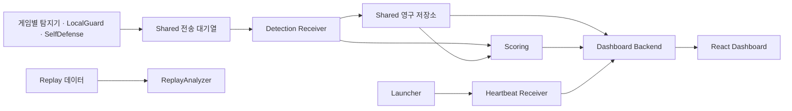

# WHS4-GZZ

**MECCHA CHAMELEON의 치트 행위와 실행 환경을 관측하고, 탐지 근거를 중앙 서버와 대시보드에서 분석하는 안티치트 연구 프로젝트입니다.**

게임별 탐지기, LocalGuard, SelfDefense, KernelSentinel을 통합 런처로 관리합니다. 공통 이벤트 전송·저장, 모듈별 판정 정책, Replay 데이터 분석, React 관제 화면을 함께 구성합니다. 치트 동작을 재현하기 위한 실험 모듈과 별도 Tools UI도 포함되어 있습니다.

> 현재 개발·통합 검증 단계입니다. 일부 실제 게임·로컬 HTTP 연동 결과가 있지만 전체 모듈의 실게임 종단 검증과 운영 서버 배포가 완료된 상태는 아닙니다. 탐지 원점수와 실행 상태를 곧바로 치트 확정이나 자동 제재로 해석하지 않습니다.

## 대시보드 미리보기


대시보드는 종합 현황, 세션, 플레이어, 이벤트, 보호 모듈, 시스템 화면을 제공합니다. 원본 탐지 근거와 서버의 최종 판정, 런처 실행 상태를 각각 확인할 수 있습니다.

## 주요 구성

| 구성 요소 | 역할 |
| --- | --- |
| Launcher | 게임·보호 모듈 실행 순서 관리, 상태 표시, 재시작·종료 처리, 하트비트 전송 |
| LocalGuard | 외부 프로세스 접근, DLL·메모리 무결성, 알려진 실행 파일 해시·YARA 패턴 관측 |
| SelfDefense | 안티치트 프로세스 감시, 배포 파일 무결성 검사, 디버거 연결 관측 |
| KernelSentinel | Windows 커널 드라이버와 사용자 공간 수집기를 통한 커널 관측 |
| 게임별 탐지기 | Aimbot, AutoPaint, ESP, GodMode, Noclip, Hide Anywhere, Whistle Spoofing 신호 수집 |
| Shared | 공통 Event 검증, 로컬 전송 대기열, HTTP 재시도, 중복 억제·영구 저장 |
| 중앙 서버 | 탐지 Event·하트비트 수신, 저장된 이벤트 복구, 판정·조회 API 제공 |
| Scoring | 모듈별 임계값·측정 유효성·사건 이력·중복 근거를 반영한 판정 |
| Dashboard | 세션·플레이어·이벤트·판정 근거·보호 모듈 실행 상태 조회 |
| ReplayAnalyzer | 저장된 NORMAL/CHEAT 세션의 임계값 비교와 CHEAT OFF 이후 탐지 지속 분석 |
| 실험 모듈·Tools UI | 통제된 시험 환경에서 치트 동작 재현·모듈 선택 |

## 데이터 흐름



- **탐지 Event**는 관측 결과와 원점수·근거를 기록합니다.
- **하트비트**는 모듈의 생존·실행·지연 상태를 보고합니다. 연결 중단만으로 치트를 판정하지 않습니다.
- **최종 판정**은 Scoring에서 제공합니다. 프론트엔드는 모듈 원점수를 합산하거나 별도의 판정을 만들지 않습니다.

## 저장소 구조

```text
WHS4-GZZ/
├─ client/
│  ├─ Launcher/              # 통합 안티치트 런처
│  ├─ LocalGuard/            # 접근·파일·메모리 관측
│  ├─ SelfDefense/           # 안티치트 자체 보호·운영 상태
│  ├─ kernel_sentinel/       # 커널 드라이버·수집기
│  └─ detectors/             # 게임별 치트 탐지기
├─ modules/                  # 치트 동작 재현용 실험 모듈
├─ shared/                   # 공통 이벤트·전송·저장 라이브러리
├─ server/
│  ├─ main.py                # FastAPI 통합 진입점
│  ├─ receiver/              # 탐지·하트비트 수신
│  ├─ scoring/               # 판정 정책·사건 이력·복구
│  ├─ dashboard_backend/     # 관제 조회 API
│  └─ Dashboard/             # React · TypeScript · Vite
├─ ReplayAnalyzer/           # Replay 데이터·분석기·수집 도구
├─ integration/
│  └─ meccha-tools-ui/       # 실험용 Tools UI
└─ deploy/                   # 서버·대시보드 배포 안내
```

## 실행 환경

| 대상 | 요구 사항 |
| --- | --- |
| 클라이언트·게임 관측 | Windows, Steam, MECCHA CHAMELEON. 기능별 Python·권한·센서 요구 사항은 해당 모듈 문서 참고 |
| Python 환경 | 로컬 시작 예시는 64비트 Python 3.12 기준. Shared는 3.10 이상이며 모든 모듈의 호환 범위가 동일하지 않음 |
| 중앙 서버 | Python, FastAPI, Uvicorn, SQLite. Ubuntu 운영 가이드는 Python 3.11 이상 기준 |
| 대시보드 | Node.js 20.19 이상(20.x) 또는 22.12 이상, npm |
| UE4SS 기반 탐지 | 팀에서 고정 해시로 검증한 UE4SS 묶음과 게임 관측 모드 |
| 커널 관측 | 관리자 권한, 설치·로드된 `KernelSentinel.sys`, 기능별 Windows 빌드 호환성 확인 |

전체 프로젝트를 한 번에 설치하는 공통 의존성 파일은 없습니다. 선택한 모듈의 의존성은 **런처를 실행하는 Python 환경**에 설치해야 합니다.

## 빠른 시작

### 1. 저장소와 Python 환경 준비

다음 예시는 PowerShell 기준입니다. 별도 안내가 없는 명령은 저장소 루트에서 실행합니다.

```powershell
git clone https://github.com/Lawliet-123/WHS4-GZZ.git
cd WHS4-GZZ
py -3.12 -m venv .venv
.\.venv\Scripts\Activate.ps1
```

### 2. 대시보드 데모 실행

서버나 게임 없이 화면부터 확인할 수 있습니다. 초기 화면은 합성 데이터를 사용하는 `DEMO` 모드입니다.

```powershell
cd server/Dashboard
npm ci
npm run dev
```

브라우저에서 [http://127.0.0.1:4173](http://127.0.0.1:4173)을 엽니다. 아래 서버 실행 단계는 새 터미널의 저장소 루트에서 진행합니다.

### 3. 중앙 API 서버 실행

가상환경을 활성화하고 서버 의존성과 로컬 전용 설정을 준비합니다. 예시 토큰은 로컬 시험용이며 실제 배포에는 독립적인 비밀값을 사용합니다.

```powershell
python -m pip install -r server/requirements.txt

$env:GZZ_TELEMETRY_TOKEN = 'local-detection-token'
$env:MECCHA_HEARTBEAT_TOKEN = 'local-heartbeat-token'
$env:GZZ_DASHBOARD_TOKEN = 'local-dashboard-token'
$env:MECCHA_HEARTBEAT_DB = 'work/local-server/heartbeat.sqlite3'
$env:GZZ_TELEMETRY_LOG_ROOT = 'work/local-server/detections'
$env:GZZ_SCORING_DB = 'work/local-server/scoring.sqlite3'
$env:GZZ_DASHBOARD_INDEX = 'work/local-server/dashboard.sqlite3'

python -m uvicorn server.main:app --host 127.0.0.1 --port 8002
```

서버가 실행되면 [http://127.0.0.1:8002/health](http://127.0.0.1:8002/health)을 확인합니다. 일반 대시보드 빌드의 `연결`에서 서버 주소를 `/dashboard-api`, Dashboard 토큰을 `local-dashboard-token`으로 지정하면 개발 프록시를 통해 LIVE 조회를 사용할 수 있습니다. 서버·프론트엔드가 실행된 것만으로 실제 게임 데이터가 생성되지는 않습니다.

### 4. 안티치트 런처 실행

Windows에서 Steam과 게임 설치를 준비한 뒤, 사용할 탐지기의 의존성을 설치합니다. 예를 들어 `input_signature`는 다음 파일을 사용합니다.

```powershell
python -m pip install -r client/LocalGuard/input_signature/requirements.txt
```

로컬 API 서버에 연결하려면 **런처를 실행할 터미널**에도 전송 설정을 제공합니다.

```powershell
$env:GZZ_TELEMETRY_URL = 'http://127.0.0.1:8002'
$env:GZZ_TELEMETRY_TOKEN = 'local-detection-token'
$env:GZZ_TELEMETRY_ALLOW_INSECURE_LOOPBACK = 'true'
$env:MECCHA_TELEMETRY_HEARTBEAT_URL = 'http://127.0.0.1:8002/api/heartbeat'
$env:MECCHA_HEARTBEAT_TOKEN = 'local-heartbeat-token'

python client/Launcher/main.py --only input_signature --no-launch-game
```

이 예시는 사용자가 Steam에서 켠 게임을 기다린 뒤 `input_signature`만 실행합니다. 전체 모듈의 준비가 끝나면 기본 런처를 사용할 수 있습니다.

```powershell
python client/Launcher/main.py
```

| 옵션 | 설명 |
| --- | --- |
| `--session ID` | 세션 식별자 지정. 생략하면 자동 생성 |
| `--player ID` | 플레이어 식별자 지정 |
| `--only a,b` | 지정한 모듈만 실행 |
| `--no-launch-game` | 게임 자동 실행 없이 실행 중인 게임을 기다림 |
| `--wait-game SEC` | 게임 실행 대기 시간 지정 |
| `--status-every SEC` | 상태 표시 간격 지정 |

게임 위치를 자동으로 찾지 못하면 `GZZ_GAME_DIR`로 설치 루트 또는 게임 실행 파일 경로를 지정할 수 있습니다. UE4SS 준비·파일 검증, Integrity 기준값, 커널 드라이버 설치는 별도 조건이므로 [Launcher 안내](client/Launcher/README.md)와 [UE4SS 안내](client/Launcher/UE4SS.md)를 확인하세요.

원격 전송에는 HTTPS를 사용합니다. `.env` 자동 로딩은 제공하지 않으며 환경변수를 실행 프로세스에 직접 전달해야 합니다. 전송 설정을 생략한 경우의 로컬 기록·실행 동작은 모듈마다 다릅니다.

## 공통 Event와 판정 원칙

탐지 Event는 다음 7개 최상위 필드를 사용합니다. 아래는 형식을 설명하기 위한 합성 예시입니다.

```json
{
  "session_id": "normal_001",
  "player_id": "player_042",
  "module": "autopaint",
  "timestamp_ms": 1234,
  "evidence": {"behavior_score": 0, "behavior_valid": 1},
  "reasons": [],
  "raw_score": 0
}
```

- `raw_score`의 척도와 임계값은 모듈마다 다릅니다. 원점수를 단순 합산하지 않습니다.
- `event_id`는 전송 헤더·저장 메타데이터에서 관리하며 공통 본문의 최상위 필드로 추가하지 않습니다.
- Shared의 `queued`는 로컬 대기열에 저장됐다는 뜻입니다. 서버 저장 ACK와 구분합니다.
- 런처의 `RUNNING`은 프로세스 생존 상태입니다. 측정 유효성·탐지 성공·서버 전송 성공을 보증하지 않습니다.
- `UNKNOWN`·`INCONCLUSIVE`는 정상 판정이 아닙니다. `NO_ACTIVE_EVIDENCE`도 해당 평가 범위에 활성 근거가 없다는 의미입니다.
- Event 시간 기준과 서버 수신 시각은 구분합니다. 기준이 확인되지 않은 `timestamp_ms`를 공통 세션 시간이나 실제 관측 시각으로 추정하지 않습니다.

세부 계약은 [전송 규약](shared/docs/PROTOCOL.md), [evidence 규칙](shared/docs/EVIDENCE.md), [Scoring 정책](server/scoring/policies/README.md)을 참고하세요.

## 검증과 Replay 분석

서버 개발 의존성을 설치한 뒤 필요한 영역을 검증할 수 있습니다.

```powershell
python -m pip install -r server/requirements-dev.txt
python -m unittest discover -s shared/tests -t . -p "test_shared*.py" -v
python -m unittest discover -s server/receiver/tests -v
python -m unittest discover -s server/scoring/tests -v
python -m unittest discover -s server/dashboard_backend/tests -v
python -m server.dashboard_backend.smoke
```

`smoke`는 임시 저장소와 로컬 HTTP 서버에 합성 데이터를 전송해 수신·저장·판정·조회 연결을 점검합니다. 실제 게임 시험은 별도로 진행해야 합니다.

대시보드 검증은 `server/Dashboard`에서 실행합니다.

```powershell
npm test
npm run build
```

ReplayAnalyzer는 저장소 루트에서 실행합니다. 저장된 Replay 세션을 읽어 모듈별 임계값 비교와 CHEAT OFF 이후 관측 결과를 CSV로 내보냅니다.

```powershell
python ReplayAnalyzer/analyzer/replay_analyzer.py
```

## 현재 검증 범위와 제한

- 로컬 HTTP·저장·Scoring·대시보드 조회의 자동화 검증과 일부 Windows·실게임 관측 기록이 있습니다. 합성 데이터 시험과 실제 게임 시험은 구분합니다.
- 전체 모듈의 실게임 종단 검증, 운영 backend 배포·인증 연결은 아직 완료되지 않았습니다.
- ESP 판정 임계값은 추가 Replay 분석·확정이 필요합니다. 일부 정상 프로세스 접근·서명 판별에서 오탐 보강 과제가 남아 있습니다.
- Hide Anywhere는 기록된 실게임 시험에서 게임 빌드·NamePool 바인딩 불일치로 측정 불가가 보고됐습니다.
- KernelSentinel은 런처가 드라이버를 설치하지 않습니다. 일부 센서는 특정 Windows 빌드에 제한되며 공통 시간축·중앙 전송 통합도 후속 작업이 필요합니다.
- 대시보드의 프론트 단독 공개 빌드는 `DEMO`이며 API 통신이 차단됩니다. 일반 LIVE 빌드와 용도가 다릅니다.

최신 근거와 개별 시험 범위는 [Dashboard 통합 상태](server/Dashboard/INTEGRATION_STATUS.md)와 [보고 근거](server/Dashboard/docs/report-evidence/REPORT_EVIDENCE.md)를 기준으로 확인하세요.

## 세부 문서

| 영역 | 문서 |
| --- | --- |
| 런처·UE4SS | [Launcher](client/Launcher/README.md) · [UE4SS](client/Launcher/UE4SS.md) |
| LocalGuard | [외부 접근](client/LocalGuard/external_access/README.md) · [DLL 무결성](client/LocalGuard/external_access/module_integrity/README.md) · [입력 시그니처](client/LocalGuard/input_signature/README.md) |
| SelfDefense | [Watchdog](client/SelfDefense/watchdog/README.md) · [Integrity](client/SelfDefense/integrity/README.md) · [AntiDebug](client/SelfDefense/anti_debug/README.md) |
| 커널 관측 | [KernelSentinel](client/kernel_sentinel/README.md) |
| 게임별 탐지기 | [Aimbot](client/detectors/aimbot/README.md) · [AutoPaint](client/detectors/autopaint/README.md) · [ESP](client/detectors/esp/README.md) · [GodMode](client/detectors/godmode/README.md) · [Noclip](client/detectors/noclip/README.md) · [Hide Anywhere](client/detectors/hide_anywhere/README_v11.md) · [Whistle](client/detectors/whistle-spoofing/WHISTLE.md) |
| 이벤트·중앙 서버 | [Shared](shared/README.md) · [서버](server/README.md) · [Receiver](server/receiver/README.md) · [Scoring](server/scoring/README.md) |
| 관제 화면 | [Dashboard](server/Dashboard/README.md) · [조회 backend](server/dashboard_backend/README.md) |
| 실험용 UI | [Tools UI](integration/meccha-tools-ui/meccha_chameleon_tools/README.md) |
| 배포 | [중앙 서버](deploy/server/README.md) · [대시보드](deploy/dashboard/README.md) |

## 개발·실험 안내

새 탐지기를 통합할 때는 `client/Launcher/modules.py`에 실행 조건을 등록하고, 공통 Event·세션·플레이어·시간 기준을 맞춥니다. 중앙 전송을 사용하는 별도 프로세스마다 독립적인 outbox 경로를 사용하세요.

실험 모듈은 허가된 로컬·비공개 시험 환경에서 사용합니다. 저장소에는 토큰, 개인 경로·식별 정보가 포함된 원본 로그, 로컬 DB를 올리지 않습니다. Replay 자료를 추가할 때는 정상·치트 라벨, 측정 유효성, ON/OFF 시점과 개인정보 필터를 확인합니다.

현재 저장소 루트에 별도의 `LICENSE` 파일은 없습니다. 코드·자료의 사용 및 재배포 조건은 저장소 관리자에게 확인하세요.
