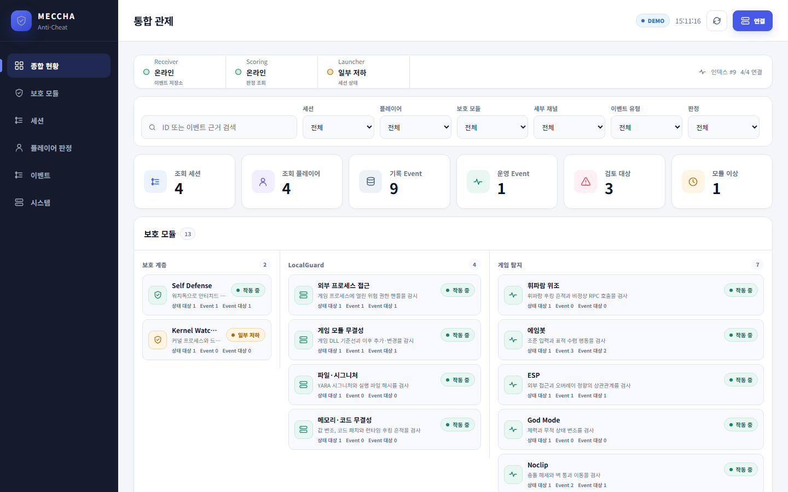

# MECCHA 종합 안티치트 Dashboard

Receiver가 받은 공통 Event, Scoring의 최종 판정, Launcher가 보고한 실행 상태를 한 화면에서 조회하는 8-A React 프론트엔드다. 특정 탐지기 하나를 위한 화면이 아니라 세션·플레이어·보호 모듈·탐지 채널·운영 상태를 함께 보는 종합 관제 화면이다.



보고용 캡처의 의미와 재현 범위는 [REPORT_EVIDENCE.md](./docs/report-evidence/REPORT_EVIDENCE.md)에 정리했다.

## 실행

Node.js 20 이상이 필요하다.

```powershell
cd .\server\Dashboard
npm install
npm run dev
```

브라우저에서 `http://127.0.0.1:4173`을 연다. 개발 서버와 `npm run preview`의 `/dashboard-api` 프록시는 기본적으로 `http://127.0.0.1:8002`의 FastAPI 서버로 전달된다.

검증 명령은 다음과 같다.

```powershell
npm test -- --run
npm run build
npm run preview
```

## 전체 데이터 흐름

```text
탐지기·LocalGuard·SelfDefense
        ↓ 공통 7필드 Event
Receiver → Shared 저장소 → Scoring → Dashboard backend
                                        ↑
Launcher heartbeat ─────────────────────┘
                                        ↓
                                  React Dashboard
```

- Receiver는 Event를 검증·저장하고 Scoring에 전달한다.
- Scoring은 모듈별 원점수 의미, Replay calibration, 측정 가능 여부와 이력 조건을 반영해 최종 판정을 만든다.
- Launcher heartbeat는 프로세스가 실제로 실행 중인지, 필수 구성 요소가 실패·중지·지연 상태인지 보고한다.
- Dashboard는 실행 상태와 탐지 근거를 서로 다른 정보로 표시한다. 프로세스가 실행 중이라고 탐지가 발생한 것은 아니며, 양수 `raw_score`가 곧 최종 의심 판정인 것도 아니다.

## Launcher 컴포넌트와 Event 채널

Launcher는 본체 상태 외에 아래 13개 보호·탐지 컴포넌트를 보고한다. 컴포넌트 ID는 프로세스 실행 단위이고 Event의 `module`은 중앙 판정 채널이므로 이름과 개수가 항상 일치하지 않는다.

| Launcher 컴포넌트 | 중앙 Event 채널 |
| --- | --- |
| `self_defense` | `selfdefense` 운영 이벤트 |
| `kernel_watcher` | 현재 heartbeat 실행 상태 중심 |
| `external_access` | `external_access`, `submodule=external_process` |
| `module_integrity` | `external_access`, `submodule=module_integrity` |
| `input_signature` | `localguard_yara`, `localguard_executable_hash` |
| `memory_integrity` | `filesystem`, `injection`, `value_tamper`, `overlay_hook`, `godmode_runtime`, `noclip_runtime`, `aimbot_runtime` |
| `whistle_spoofing` | `whistle`, `whistle_rpc` |
| `aimbot` | `aimbot` |
| `esp` | `esp` |
| `godmode` | `godmode` |
| `noclip` | `noclip` |
| `autopaint` | `autopaint` |
| `hide_anywhere` | `hide_anywhere` |

`launcher` 컴포넌트는 위 13개와 별도로 Launcher 본체의 생존·정리 단계를 나타낸다. 화면은 이 실행 컴포넌트 목록과 Event 채널 목록을 합쳐 하나의 점수로 만들지 않는다.

## 화면 구성

- 전체 현황: Receiver·Scoring·Launcher 연결 상태, 인덱스 동기화, Event 범위
- 세션·플레이어: 최종 판정별 대상 목록과 선택한 대상의 상세 상태
- 모듈 관제: 13개 Launcher 컴포넌트의 실행·필수 여부·신선도와 전송 상태
- 판정 근거: `SUSPICIOUS`, `INCONCLUSIVE`, `NO_ACTIVE_EVIDENCE`, `UNKNOWN`, 근거 단위와 미해결·보류·사용 불가 모듈
- 정책 상태: 최신 원본 관측과 policy의 emission·측정 상태·주의사항
- 타임라인: 서버 저장 `sequence`를 기준으로 탐지 Event와 운영 Event를 함께 표시
- Event 로그: 세션·플레이어·모듈·submodule·Event 종류·판정 필터와 원본 evidence 상세

`overview.counts.sessions`와 `players`는 `scope=indexed_events` 범위다. Event 없이 heartbeat만 수신한 대상은 목록과 실행 상태에는 나타날 수 있지만 이 숫자에는 포함되지 않는다.

## 판정 표시 원칙

- 최종 판정은 Scoring 응답을 그대로 사용한다.
- `UNKNOWN`과 `INCONCLUSIVE`를 정상으로 바꾸지 않는다.
- `NO_ACTIVE_EVIDENCE`는 현재 평가 범위에 활성 근거가 없다는 뜻이며 전체 PC의 정상 보증이 아니다.
- 모듈마다 `raw_score` 생성식과 threshold가 다르므로 서로 합산하거나 같은 색 기준으로 비교하지 않는다.
- `score`와 `confidence`가 `null`이면 임의의 숫자 위험도나 확률을 만들지 않고 화면에 `미제공`으로 표시한다.
- `event_kind=operational`은 실행·보호 상태 기록이며 탐지 Event와 구분한다.
- `time_basis=unknown`이면 정밀한 공통 시간축으로 단정하지 않고 서버 `sequence`를 기본 순서로 사용한다.

현재 calibration에서 ESP와 `external_access`는 pending이다. 데모의 ESP 양수 관측은 확정 ACTIVE 근거가 아니라 `INCONCLUSIVE`로 표현한다. Noclip은 Replay-v1 threshold 3에 맞춰 최신 유효 `raw_score=3` 예시를 `SUSPICIOUS`로 표현한다.

## 데이터 연결

초기 화면은 backend v2 응답 형태의 합성 데이터이며 상단 `DEMO` 배지로 구분한다. `연결`에서 서버 주소와 Dashboard Bearer token을 입력하면 LIVE 모드로 전환된다. 토큰은 React 메모리에만 두고 `localStorage`에 저장하지 않는다.

사용 API:

```text
GET /api/dashboard/overview
GET /api/dashboard/events
GET /api/dashboard/events/{event_id}
GET /api/dashboard/sessions/{session_id}/players/{player_id}/snapshot
GET /api/dashboard/sessions/{session_id}/players/{player_id}/history
GET /api/dashboard/sessions/{session_id}/players/{player_id}/status
Authorization: Bearer <GZZ_DASHBOARD_TOKEN>
```

`overview.events`는 의도적으로 빈 배열이며 Event는 `/events`에서 읽는다. Event cursor는 첫 응답의 `through_sequence`에 고정해 끝까지 읽고, 이후 polling은 마지막 `sequence`를 `after_sequence`로 전달한다. 실서버 오류를 합성 데이터로 자동 대체하지 않는다.

대상을 선택하면 snapshot, 실행 상태, GodMode 사건 이력을 서로 독립적으로 조회한다. 한 조회가 실패해도 성공한 다른 정보는 유지하며, GodMode 이력 항목을 누르면 해당 `event_id`로 원본 Event 상세를 다시 조회한다.

각 endpoint 응답은 화면이 사용하는 필수 필드와 중첩 자료형을 런타임에 검증한다. 계약이 달라진 응답은 부분 렌더링하지 않고 연결·갱신 오류로 표시하며, 응답 본문이나 토큰은 오류 메시지에 포함하지 않는다.

운영 배포에서는 장기 Bearer token을 브라우저 bundle에 넣지 않는다. 중앙 FastAPI와 same-origin으로 배치한 BFF·reverse proxy 또는 별도의 Dashboard 세션 인증이 필요하다.

## 소스 구조

```text
server/Dashboard/
├─ src/
│  ├─ components/           연결 dialog, Event drawer, 공통 UI
│  ├─ api.ts                Dashboard v2 API와 pagination
│  ├─ domain.ts             필터·상태·표시 함수
│  ├─ mockData.ts           계약 기반 종합 관제 합성 데이터
│  ├─ types.ts              Dashboard v2 타입
│  ├─ App.tsx               화면 상태와 polling
│  └─ styles.css            반응형 디자인
├─ API_REQUIREMENTS.md      backend 계약과 표시 규칙
├─ INTEGRATION_STATUS.md    연결 완료 범위와 담당자별 남은 계약
├─ DESIGN.md                정보 구조와 UX 기준
└─ vite.config.ts           4173 포트와 8002 프록시
```

실제 통합 전에 [INTEGRATION_STATUS.md](./INTEGRATION_STATUS.md)의 백엔드·Launcher 확인 항목과 종단 점검 순서를 함께 확인한다.
