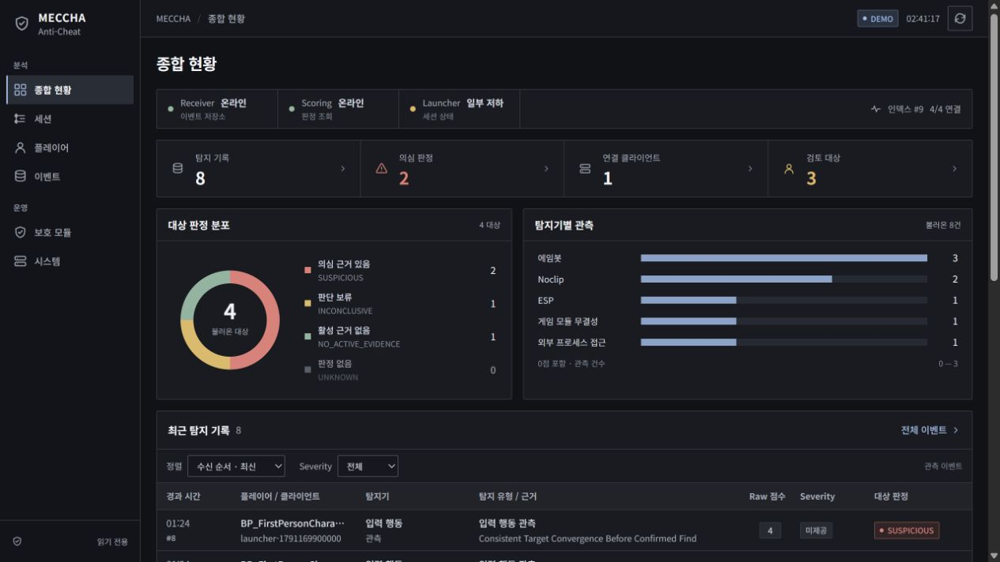

# MECCHA 종합 안티치트 Dashboard

Receiver가 받은 공통 Event, Scoring의 최종 판정, Launcher가 보고한 실행 상태를 조회하는 8-A React 프론트엔드다. 종합 현황·세션·플레이어·이벤트·보호 모듈·시스템을 각각 독립 페이지로 구성한다. 특정 탐지기 하나를 위한 화면이 아니라 전체 안티치트의 관제 화면이다.



보고용 캡처의 의미와 재현 범위는 [REPORT_EVIDENCE.md](./docs/report-evidence/REPORT_EVIDENCE.md)에 정리했다.

종합 현황의 판정 도넛·탐지기별 관측 막대를 선택하면 필터된 목록으로 이동한다. 세션 페이지에서는 한 세션의 수신 순번별 관측을 그래프로 확인한다. 그래프는 실제 로드된 응답만 집계하며 원점수를 합산하거나 시간 기준을 추정하지 않는다.

## 실행

설치된 Vite 기준 Node.js 20.19 이상(20.x) 또는 22.12 이상이 필요하다. 이번 검증에는 Node.js 24.18을 사용했다.

```powershell
cd .\server\Dashboard
npm install
npm run dev
```

브라우저에서 `http://127.0.0.1:4173`을 연다. 개발 서버와 `npm run preview`의 `/dashboard-api` 프록시는 기본적으로 `http://127.0.0.1:8002`의 FastAPI 서버로 전달된다.

검증 명령은 다음과 같다.

```powershell
npm test -- --run
npm run build
npm run preview
```

## 프론트 단독 공개 배포

공개 주소: [kkinomalo.com/GZZ/](https://kkinomalo.com/GZZ/)

이 주소는 화면 확인용 DEMO 배포다. 중앙 안티치트 서버·Receiver·Scoring·Launcher를 배포하거나 실제 로그를 공개한 것이 아니다. 공개 빌드는 서버 연결 dialog와 토큰 입력을 제외하고, HTML meta CSP의 `connect-src 'none'`으로 API 통신도 차단한다. 정적 파일 API 배포에서 `vercel.json`의 HTTP 헤더가 자동 적용된다고 가정하지 않는다. 기존 일반 빌드에는 이 meta를 넣지 않아 LIVE 연결 기능을 유지한다.

```powershell
cd "C:\Users\nojiw\Downloads\WHS4-GZZ-dashboard-react\server\Dashboard"
npm run build:gzz
npm run preview -- --mode frontend --base /GZZ/ --outDir dist-gzz --port 4174 --host 127.0.0.1 --strictPort
```

산출물은 `dist-gzz/index.html`과 해시가 붙은 JS·CSS 두 파일이다. Vercel `gzz-dashboard-frontend` 프로젝트에는 이 세 파일을 `GZZ/` 아래에 배치하고 [정적 배포 설정](./deployment/vercel.gzz.json)만 추가한다. 소스 저장소 전체, `.env`, 실제 세션 로그, 다른 서비스 파일은 업로드하지 않는다.

도메인의 기존 `kkinomalo-archive` 프로젝트에는 [단일 CDN rewrite](./deployment/gzz-route.json)를 적용했다. `/GZZ` 및 하위 경로만 별도 프론트로 연결하며 기존 홈페이지 소스·API·도메인 연결을 바꾸지 않는다. 해시 라우터이므로 `/GZZ/#/events` 직접 접속과 새로고침을 지원한다.

프론트 재배포는 `gzz-dashboard-frontend`만 대상으로 한다. 원래 도메인 프로젝트에 이 Dashboard를 통째로 배포하거나 도메인을 새 프로젝트로 이동하지 않는다. 중단이 필요하면 기존 프로젝트의 `GZZ frontend` CDN 규칙만 비활성화한다. [Vercel 프로젝트 라우팅 설명](https://vercel.com/docs/routing/project-routing-rules)

## 전체 데이터 흐름

```text
탐지기·LocalGuard·SelfDefense
        ↓ 공통 7필드 Event
Receiver → Shared 저장소 → Scoring → Dashboard backend
                                        ↑
Launcher heartbeat ─────────────────────┘
                                        ↓
                                  React Dashboard
```

- Receiver는 Event를 검증·저장하고 Scoring에 전달한다.
- Scoring은 모듈별 원점수 의미, Replay calibration, 측정 가능 여부와 이력 조건을 반영해 최종 판정을 만든다.
- Launcher heartbeat는 프로세스가 실제로 실행 중인지, 필수 구성 요소가 실패·중지·지연 상태인지 보고한다.
- Dashboard는 실행 상태와 탐지 근거를 서로 다른 정보로 표시한다. 프로세스가 실행 중이라고 탐지가 발생한 것은 아니며, 양수 `raw_score`가 곧 최종 의심 판정인 것도 아니다.

## Launcher 컴포넌트와 Event 채널

Launcher는 본체 상태 외에 아래 13개 보호·탐지 컴포넌트를 보고한다. 컴포넌트 ID는 프로세스 실행 단위이고 Event의 `module`은 중앙 판정 채널이므로 이름과 개수가 항상 일치하지 않는다.

| Launcher 컴포넌트 | 중앙 Event 채널 |
| --- | --- |
| `self_defense` | `selfdefense` 운영 이벤트 |
| `kernel_watcher` | 현재 heartbeat 실행 상태 중심 |
| `external_access` | `external_access`, `submodule=external_process` |
| `module_integrity` | `external_access`, `submodule=module_integrity` |
| `input_signature` | `localguard_yara`, `localguard_executable_hash` |
| `memory_integrity` | `filesystem`, `injection`, `value_tamper`, `overlay_hook`, `godmode_runtime`, `noclip_runtime`, `aimbot_runtime` |
| `whistle_spoofing` | `whistle`, `whistle_rpc` |
| `aimbot` | `aimbot` |
| `esp` | `esp` |
| `godmode` | `godmode` |
| `noclip` | `noclip` |
| `autopaint` | `autopaint` |
| `hide_anywhere` | `hide_anywhere` |

`launcher` 컴포넌트는 위 13개와 별도로 Launcher 본체의 생존·정리 단계를 나타낸다. 화면은 이 실행 컴포넌트 목록과 Event 채널 목록을 합쳐 하나의 점수로 만들지 않는다.

## 화면 구성

| 페이지 | 경로 | 주요 내용 |
| --- | --- | --- |
| 종합 현황 | `#/overview` | 연결 상태, 작은 핵심 지표, 최근 탐지 표, 검토 대상 |
| 세션 | `#/sessions` | 세션 목록, 플레이어 판정 요약, Launcher 연결 |
| 플레이어 | `#/players` | 대상 목록과 판정·타임라인·모듈 신호·실행 상태·사건 이력 탭 |
| 이벤트 | `#/events` | 검색·필터·정렬, 탐지 표, 조사 패널과 원본 evidence |
| 보호 모듈 | `#/modules` | 전체 13개 컴포넌트의 상태와 이벤트 대상 수, 이벤트 조회 바로가기 |
| 시스템 | `#/system` | Receiver·Scoring·Launcher, 전체 실행 상태와 capability |

선택한 페이지의 내용만 렌더링한다. 주소 직접 접속·새로고침·뒤로/앞으로 이동을 지원하고, 이전 `#overview`, `#subjects`, `#systems` 주소도 새 페이지에 대응시킨다. 필터와 서버 연결은 페이지를 이동해도 유지된다. 종합 현황은 항상 전체 조회 범위이며 요약에서 목록으로 들어가면 필터를 초기화한다.

기본 필터는 검색·세션·플레이어다. 모듈·submodule·이벤트 유형·판정은 `상세 필터`로 펼친다. 세션 선택은 해당 세션의 플레이어 목록으로 이동하고, 모듈의 이벤트 버튼은 해당 모듈로 필터한 이벤트 페이지로 이동한다.

`overview.counts.sessions`와 `players`는 `scope=indexed_events` 범위다. 종합 현황의 `탐지 기록`은 적재된 관측 이벤트 수로 0점 정상 sample도 포함한다. `연결 클라이언트`는 조회 범위의 최신 Launcher에서 healthy/online이며 connected인 고유 client_id 수다. client_id가 없으면 미제공으로 표시하며 전체 활성 PC 수로 해석하지 않는다. 표의 클라이언트는 최신 Heartbeat 소스이며 Event 발신자 보증이 아니다.

2026-10-06 화면은 dark SOC 콘솔로 개편했다. 180px 사이드바, 작은 요약 strip, 8열 탐지 표, 오른쪽 조사 패널을 사용한다. 원점수나 판정으로 severity를 추정하지 않는다. 선택적 `evidence.severity`가 4개 표준 문자열로 제공될 때만 색을 표시하고 현재 계약에서 빠진 값은 `미제공`이다. Critical 요약도 전체 관측의 명시적 severity가 없으면 미제공으로 유지한다. 실제 사건 Assign/Resolve·제재 API가 없으므로 이런 조작 버튼은 제공하지 않는다. 상세 설계는 [DESIGN.md](./DESIGN.md)를 참고한다.

## 판정 표시 원칙

- 최종 판정은 Scoring 응답을 그대로 사용한다.
- `UNKNOWN`과 `INCONCLUSIVE`를 정상으로 바꾸지 않는다.
- `NO_ACTIVE_EVIDENCE`는 현재 평가 범위에 활성 근거가 없다는 뜻이며 전체 PC의 정상 보증이 아니다.
- 모듈마다 `raw_score` 생성식과 threshold가 다르므로 서로 합산하거나 같은 색 기준으로 비교하지 않는다.
- `score`와 `confidence`가 `null`이면 임의의 숫자 위험도나 확률을 만들지 않고 화면에 `미제공`으로 표시한다.
- `event_kind=operational`은 실행·보호 상태 기록이며 탐지 Event와 구분한다.
- `time_basis=unknown`이면 정밀한 공통 시간축으로 단정하지 않고 서버 `sequence`를 기본 순서로 사용한다.

현재 calibration에서 ESP는 pending이다. `external_access`는 하위 채널을 따로 평가하며 `external_process`는 threshold 2, `module_integrity`는 사건 threshold 2를 사용한다. 하위 채널을 구분할 수 없는 과거 aggregate는 pending을 유지한다. ESP 관측만으로 확정 ACTIVE 근거를 만들지 않으며, 같은 대상에 다른 모듈의 유효한 근거가 있으면 서버가 반환한 `SUSPICIOUS`를 그대로 표시한다. Noclip은 Replay-v1 threshold 3을 사용한다.

## 데이터 연결

일반 빌드의 초기 화면은 backend v2 응답 형태의 합성 데이터이며 상단 `DEMO` 배지로 구분한다. `연결`에서 서버 주소와 Dashboard Bearer token을 입력하면 LIVE 모드로 전환된다. 토큰은 React 메모리에만 두고 `localStorage`에 저장하지 않는다. 공개 `/GZZ/`의 프론트 단독 빌드에서는 이 연결 기능을 제외했다.

사용 API:

```text
GET /api/dashboard/overview
GET /api/dashboard/events
GET /api/dashboard/events/{event_id}
GET /api/dashboard/sessions/{session_id}/players/{player_id}/snapshot
GET /api/dashboard/sessions/{session_id}/players/{player_id}/history
GET /api/dashboard/sessions/{session_id}/players/{player_id}/status
Authorization: Bearer <GZZ_DASHBOARD_TOKEN>
```

`overview.events`는 의도적으로 빈 배열이며 Event는 `/events`에서 읽는다. Event cursor는 첫 응답의 `through_sequence`에 고정해 끝까지 읽고, 이후 polling은 마지막 `sequence`를 `after_sequence`로 전달한다. 실서버 오류를 합성 데이터로 자동 대체하지 않는다.

대상을 선택하면 snapshot, 실행 상태, GodMode 사건 이력을 서로 독립적으로 조회한다. 한 조회가 실패해도 성공한 다른 정보는 유지하며, GodMode 이력 항목을 누르면 해당 `event_id`로 원본 Event 상세를 다시 조회한다.

각 endpoint 응답은 화면이 사용하는 필수 필드와 중첩 자료형을 런타임에 검증한다. 계약이 달라진 응답은 부분 렌더링하지 않고 연결·갱신 오류로 표시하며, 응답 본문이나 토큰은 오류 메시지에 포함하지 않는다.

운영 배포에서는 장기 Bearer token을 브라우저 bundle에 넣지 않는다. 중앙 FastAPI와 same-origin으로 배치한 BFF·reverse proxy 또는 별도의 Dashboard 세션 인증이 필요하다.

## 소스 구조

```text
server/Dashboard/
├─ src/
│  ├─ components/           연결 dialog, Event drawer, 공통 UI
│  ├─ api.ts                Dashboard v2 API와 pagination
│  ├─ domain.ts             필터·상태·표시 함수
│  ├─ mockData.ts           계약 기반 종합 관제 합성 데이터
│  ├─ navigation.ts         페이지 주소와 이전 주소 대응
│  ├─ types.ts              Dashboard v2 타입
│  ├─ App.tsx               화면 상태와 polling
│  └─ styles.css            반응형 디자인
├─ API_REQUIREMENTS.md      backend 계약과 표시 규칙
├─ INTEGRATION_STATUS.md    연결 완료 범위와 담당자별 남은 계약
├─ DESIGN.md                정보 구조와 UX 기준
└─ vite.config.ts           4173 포트와 8002 프록시
```

실제 통합 전에 [INTEGRATION_STATUS.md](./INTEGRATION_STATUS.md)의 백엔드·Launcher 확인 항목과 종단 점검 순서를 함께 확인한다.

## 백엔드와 함께 안전하게 화면 시험하기

최신 main의 `server.main`에 backend v2 라우터가 이미 연결되어 있다. 예전 ZIP의 서버 파일을 다시 덮어쓰지 않는다. 게임이나 운영 로그 없이 실제 HTTP·브라우저 연동을 재현하려면 레포 루트에서 다음을 실행한다.

```powershell
py -3.11 -m venv .venv-dashboard-integration
.\.venv-dashboard-integration\Scripts\python.exe -m pip install -r server\requirements-dev.txt
.\.venv-dashboard-integration\Scripts\python.exe -m server.dashboard_backend.browser_smoke serve --port 8002 --duration 300
```

다른 터미널에서 `server/Dashboard`의 `npm run dev`를 실행한다. 일반 화면의 `연결`에서 서버 주소 `/dashboard-api`와 fixture가 출력한 **합성 테스트 전용** Dashboard 토큰을 입력한다. 운영 토큰을 사용하지 않는다. fixture는 임시 저장소·새 run ID로 6개 합성 Event와 4개 Launcher heartbeat를 만들고 실제 B 판정 3종 + UNKNOWN을 제공한다. 5초마다 heartbeat를 갱신하며 지정 시간이 지나거나 Ctrl+C를 누르면 자신이 띄운 서버와 임시 자료를 정리한다. 이미 사용 중인 8002 포트에서는 시작하지 않는다.

자동 갱신 시험은 fixture가 출력한 run ID를 사용한다.

```powershell
.\.venv-dashboard-integration\Scripts\python.exe -m server.dashboard_backend.browser_smoke add --port 8002 --run-id <출력된-run-id>
```

새 Noclip 관측 1개와 heartbeat를 실제 Receiver에 전송한다. 화면은 자동 polling으로 6→7건과 해당 대상의 SUSPICIOUS 판정 전환을 반영해야 한다. fixture 종료 후에는 기존 자료를 유지하면서 LIVE 지연·서버 오류를 표시해야 한다. `add`는 해당 run의 합성 대상이 있는 loopback fixture를 확인한 뒤에만 전송한다. 부모 fixture 프로세스를 강제 종료하지 말고 Ctrl+C 또는 자연 종료를 사용한다.

공개 `build:gzz`는 이 시험에 사용하지 않는다. CSP로 API 요청을 막는 오프라인 DEMO이다. 운영 브라우저 로그인·인증 프록시와 실게임 E2E는 아직 별도의 공동 작업이다.
